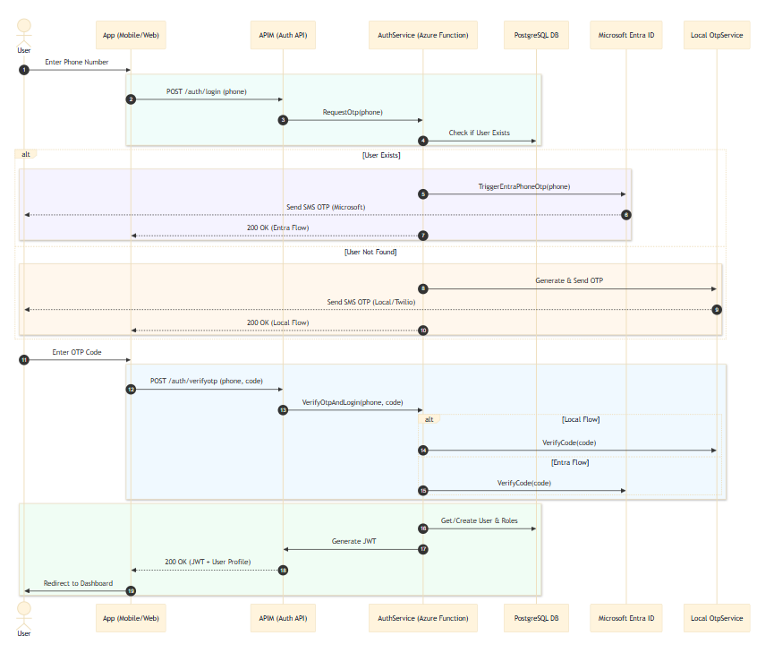
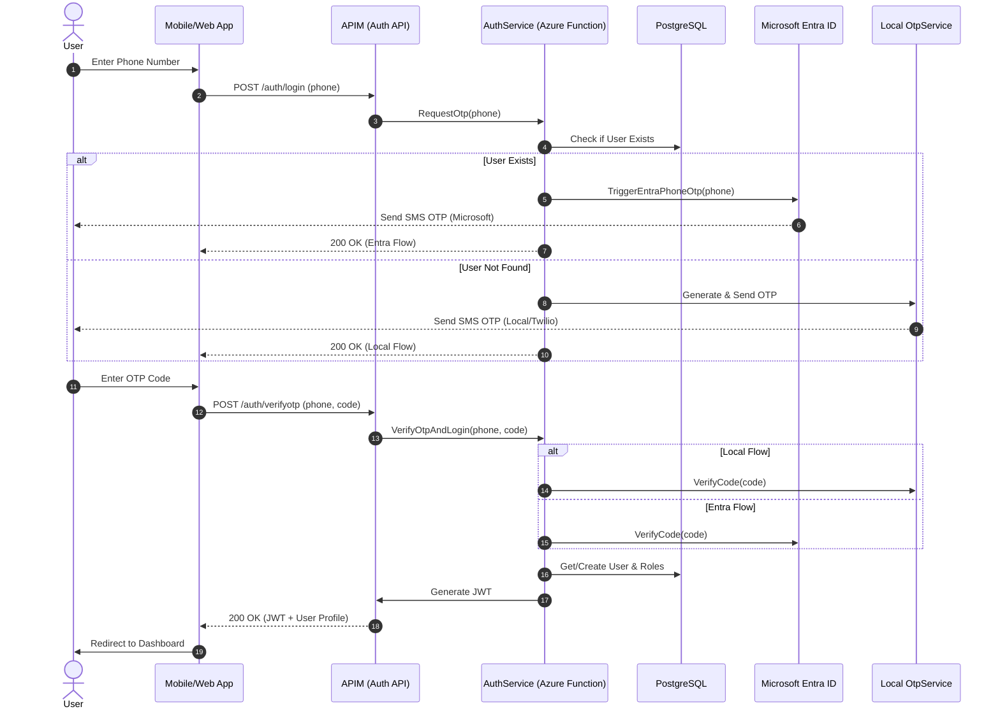

# StayHere Authentication Flow Documentation

This document outlines the hybrid authentication strategy used by StayHere, which utilizes Microsoft Entra ID for existing users and a local OTP service for new user onboarding.

## Sequence Diagram

View Mermaid Source Code

## Detailed Steps

### 1. Requesting OTP
The `AuthService` acts as a traffic controller. It queries the database to see if the phone number is recognized.
- **Existing Users**: Redirected to the Entra ID security stack. This ensures that if the user has advanced security settings or MFA enabled in Entra, those are respected.
- **New Users**: Handled by our internal `OtpService`. This allows us to track onboarding conversion and manage the sign-up experience closely.

### 2. Verifying OTP
The verification logic is similarly split.
- **Local Verification**: Checks against the `OtpVerifications` table for a match and expiry.
- **Entra Verification**: Validates the code against the Microsoft Graph API.

### 3. Session Creation
Regardless of the verification source, once validated, the system:
1.  Retrieves the user's roles (e.g., `PropertyOwner`, `Tenant`).
2.  Generates a standard JWT signed by our internal secret (stored in Key Vault).
3.  Returns the JWT to the application for all subsequent API calls.

## Infrastructure Support (IaC)
This entire flow is supported by the Terraform configurations in:
- `modules/security`: Handles the Entra App Registration and Graph Permissions.
- `modules/compute`: Configures the Function App with Key Vault references for the Entra Client Secret.
